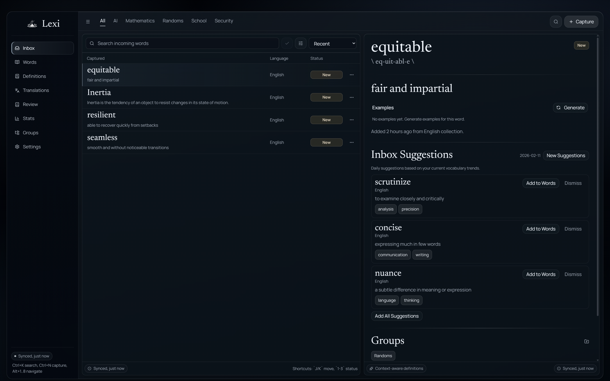
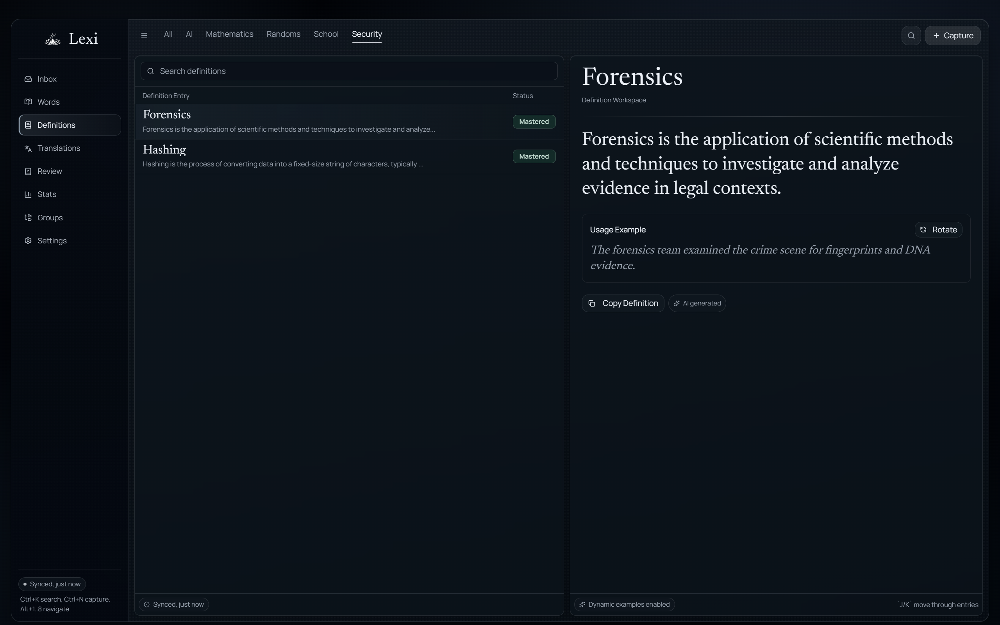
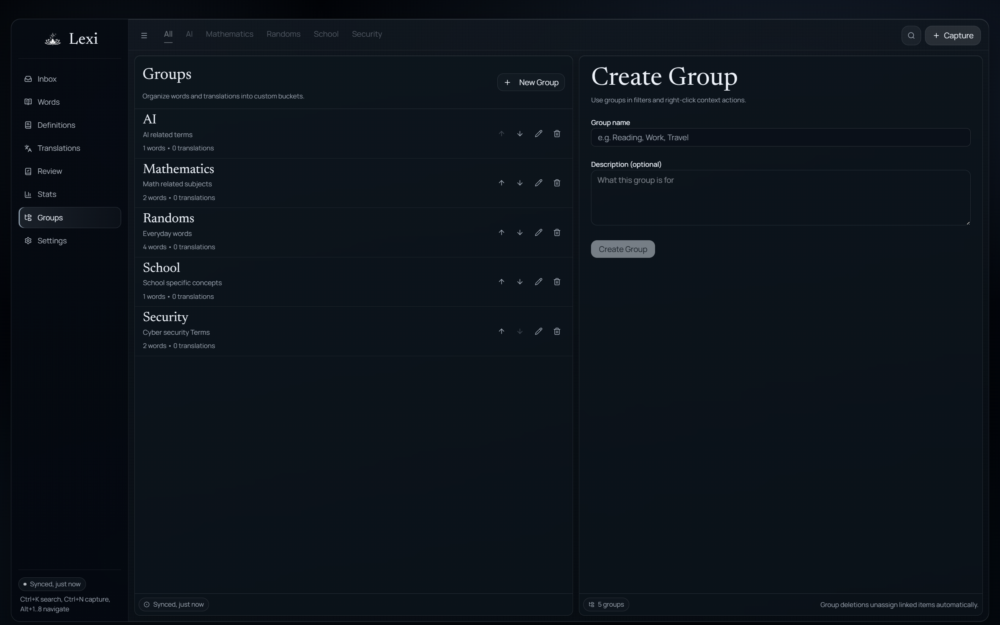
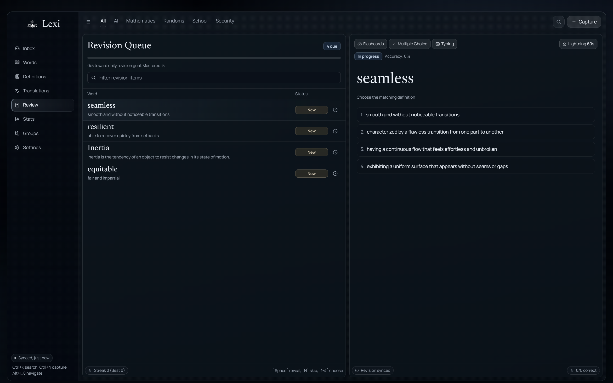
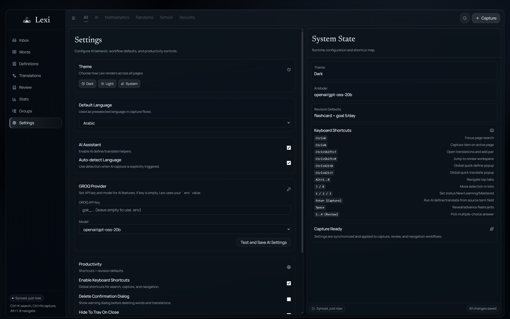
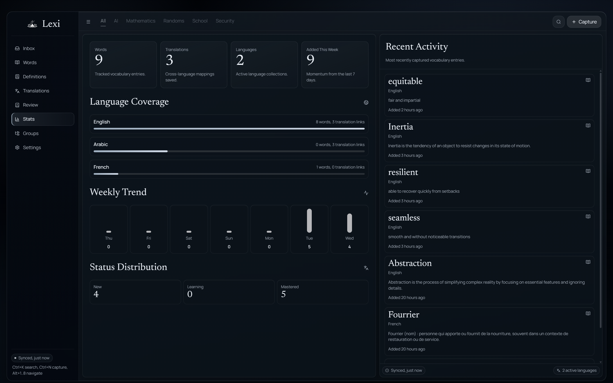
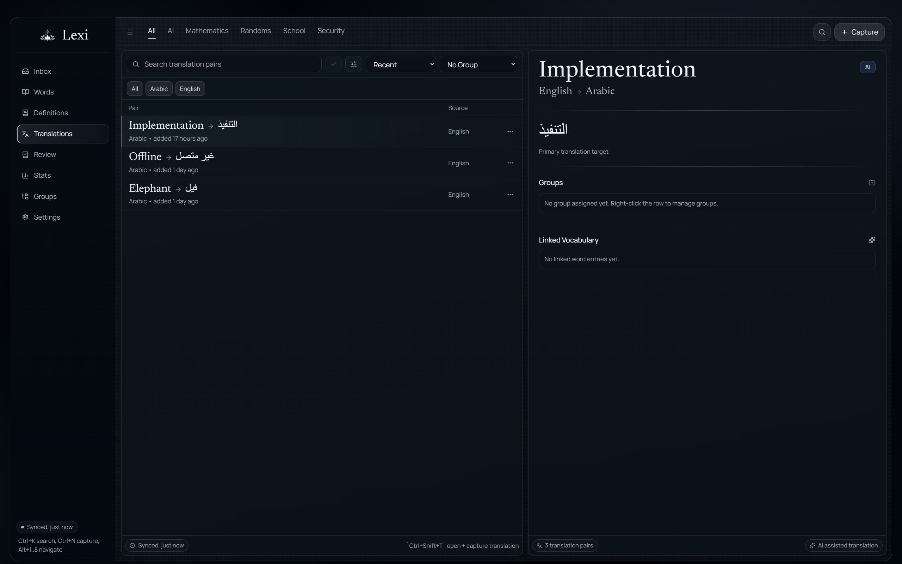
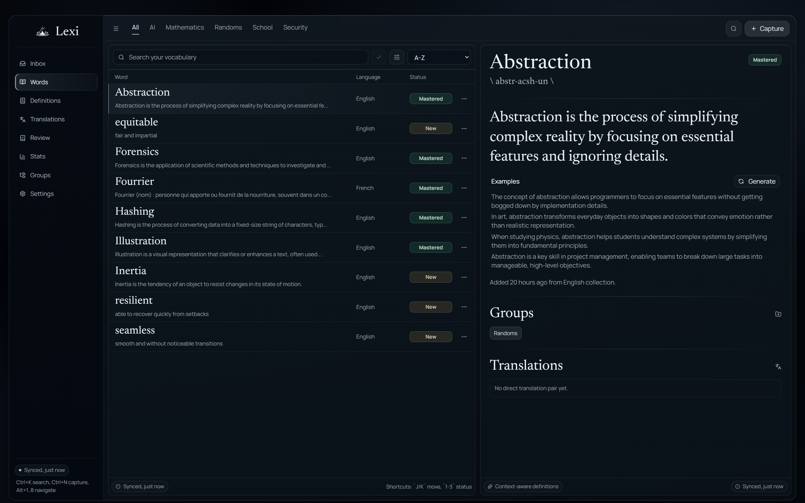

<h1 style="font-family: Arial, sans-serif; font-size: 36px; color: #ffffff; display: flex; align-items: center; border-bottom: 3px solid #ffffff; padding-bottom: 5px;">
    
    Lexi
</h1>
Lexi is a modern, privacy-first, AI-assisted vocabulary desktop app for capturing words, building translations, reviewing definitions, and learning faster with global quick actions.

---

## Tech Used 🧑‍💻


---

## Screenshots 📸

Here are screenshots of various features:



*The Inbox section where you can capture and manage new words and phrases from your daily reading or conversations.*



*View and edit detailed definitions for your vocabulary words to enhance understanding.*



*Organize your words into custom groups for thematic learning and better organization.*



*Practice and review your vocabulary with interactive flashcards and spaced repetition.*



*Customize app preferences, themes, and configurations to suit your learning style.*



*Track your learning progress with detailed statistics and performance metrics.*



*Manage translations for words across multiple languages to support bilingual learning.*



*Browse and manage your complete word collection with search and filtering options.*

---

## AI and Data Notes 🧠

- Lexi uses AI services through the `ai` SDK and Groq integration (`@ai-sdk/groq`) for language tasks.
- Local app data is stored with SQLite via `tauri-plugin-sql`.
- Clipboard and quick-capture flows are enabled through Tauri plugins.

---

## Project Structure

```plaintext
/ (root)
├── README.md                 # Project documentation.
├── example_readme.md         # Style/template reference used for this README.
├── package.json              # Frontend dependencies and scripts.
├── pnpm-lock.yaml            # pnpm lockfile.
├── vite.config.ts            # Vite configuration.
├── public/                   # Static assets.
│   └── icon.png
├── src/                      # React + TypeScript frontend.
│   ├── components/           # Reusable UI and domain components.
│   ├── hooks/                # App hooks (AI, storage, words, translations, theme).
│   ├── layout/               # App shell, titlebar, navigation.
│   ├── routes/               # Feature routes (Inbox, Words, Translations, etc.).
│   ├── styles/               # Global and feature styles.
│   ├── utils/                # Utilities and storage helpers.
│   ├── App.tsx               # Route composition and quick-mode switching.
│   └── main.tsx              # Frontend entry point.
└── src-tauri/                # Rust backend and Tauri configuration.
    ├── src/lib.rs            # Commands, tray setup, quick windows, shortcuts.
    ├── tauri.conf.json       # App window and bundling configuration.
    └── Cargo.toml            # Rust dependencies.
```

---

## Setup and Development 🛠️

1. **Prerequisites:**  
   - Node.js 18+
   - `pnpm`
   - Rust (stable)
   - Tauri prerequisites for your OS: https://tauri.app/start/prerequisites/

2. **Install Dependencies:**
   ```sh
   pnpm install
   ```

3. **Run in Development:**
   ```sh
   pnpm start
   ```

4. **Build Frontend Bundle:**
   ```sh
   pnpm build
   ```

5. **Run Tauri CLI Commands (optional):**
   ```sh
   pnpm tauri -- --help
   ```

---

## Recommended IDE Setup 💻

* [VS Code](https://code.visualstudio.com/)
* [Tauri for VS Code](https://marketplace.visualstudio.com/items?itemName=tauri-apps.tauri-vscode)
* [rust-analyzer](https://marketplace.visualstudio.com/items?itemName=rust-lang.rust-analyzer)

---

## Contributing 👥

Contributions are welcome.

1. Open an issue describing the bug, idea, or improvement.
2. Fork the repository.
3. Create a branch (`git checkout -b feature/your-feature`).
4. Commit changes (`git commit -m "Add your feature"`).
5. Push your branch (`git push origin feature/your-feature`).
6. Open a Pull Request.

---

## Roadmap 🗺️

### Phase 1: Core Vocabulary Platform
- [x] Word and definition management.
- [x] Translation management.
- [x] Grouping and filtering.
- [x] Quick define/translate mini windows.

### Phase 2: Learning and Productivity
- [x] Review workflows.
- [x] Stats dashboard.
- [x] Tray integration and hide-to-tray behavior.

### Phase 3: Next Improvements
- [ ] Richer progress analytics.
- [ ] Import/export workflows.
- [ ] Expanded language tooling and quality controls.

---

## License ⚖️

No license file is currently present in this repository. Add a `LICENSE` file to define usage terms.

---

## Contact 📬

- Open an issue in this repository for bugs, ideas, or support.

---
